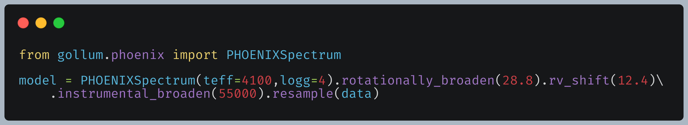

.. gollum documentation master file

gollum's documentation
======================

The goal of this repo is to provide a Python Application Programming Interface (API) to several different synthetic spectral models.  *gollum* will be built on the astropy affiliated package `specutils <https://specutils.readthedocs.io/en/stable/>`_ , and will be inspired by the API design of `lightkurve <http://docs.lightkurve.org/>`_ .  This project is loosely related to the parallel `muler <http://muler.readthedocs.io>`_ framework that is built on specutils and focuses on data.  This project is all about accessing spectral models (we do not `yet` support interpolation!).  The code itself and will have some overlap with functionality in `Starfish <https://starfish.readthedocs.io/en/latest/>`_ , and this project could one day become a microservice to Starfish, rather than duplicate code.

`gollum` makes it easy to chain routine operations in sequence:

.. toctree::
   :hidden:
   :caption: Getting Started
   :maxdepth: 1

   Installation <install>
   Downloading Model Grids <fetching_models>
   Quick Start <quickstart.ipynb>

.. toctree::
  :hidden:
  :caption: Tutorials
  :maxdepth: 3

  Tutorials <tutorials/index>

.. toctree::
   :hidden:
   :caption: API
   :maxdepth: 1

   Application Programming Interface <api>
